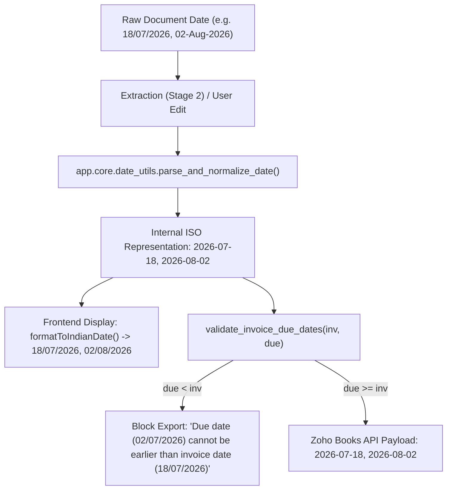

# Date Format Standardization Report: DD/MM/YYYY

**Standardization Scope:** End-to-end global date format standardization across Extraction, Ingestion, Normalization, UI Display, Export Validation, and Zoho Books API mapping.

---

## 1. Executive Summary

- **Project Standard Date Format:** `DD/MM/YYYY` (e.g. `18/07/2026`, `02/08/2026`, `31/08/2026`).
- **Internal Storage / Database / Engine Format:** Strict ISO `YYYY-MM-DD` (e.g. `2026-07-18`, `2026-08-02`), standardizing all computations across GST, ITC, and Journal engines.
- **Frontend User-Facing Display:** `DD/MM/YYYY` everywhere in Invoice Workspace, Tables, and Validation Alerts.
- **Zoho Books Export API:** Mapped cleanly as ISO `YYYY-MM-DD` without any day/month inversion or `MM/DD/YYYY` ambiguity.

---

## 2. Implemented Architecture & Flow



---

## 3. Detailed Component Breakdown

### 1. Invoice Extraction & Normalization
- `backend/app/core/date_utils.py`:
  - `parse_and_normalize_date()` prioritizes Indian standard `DD/MM/YYYY` (`dayfirst=True`), correctly interpreting `02/08/2026` as **2 August 2026** (`2026-08-02`), never `2026-02-08`.
  - `format_to_indian_standard()` converts normalized date to `DD/MM/YYYY`.
  - `format_to_zoho_date()` produces ISO `YYYY-MM-DD` for external Zoho API calls.

### 2. Frontend Display
- `frontend/src/app/finance/invoices/[id]/page.tsx`:
  - Added `formatToIndianDate()` to format all loaded `invoice_date` and `due_date` inputs as `DD/MM/YYYY`.

### 3. Zoho Export Pre-Validation
- `backend/app/services/export_service.py`:
  - Validates `due_date >= invoice_date` before initiating Zoho Books calls.
  - Returns clear validation message in standard format: `"Cannot export to Zoho: Due date (02/07/2026) cannot be earlier than invoice date (18/07/2026)."`.

---

## 4. Regression Test Results

Suite: `pytest backend/tests/test_date_normalization_and_validation.py -v`

| Test Assertion | Input | Output / Behavior | Status |
|---|---|---|---|
| Indian Standard `DD/MM/YYYY` | `18/07/2026` | `2026-07-18` | **PASS** |
| Indian Standard `DD/MM/YYYY` | `02/08/2026` | `2026-08-02` | **PASS** |
| Month End `DD/MM/YYYY` | `31/08/2026` | `2026-08-31` | **PASS** |
| Fiscal Year Start `DD/MM/YYYY` | `01/04/2026` | `2026-04-01` | **PASS** |
| Anti-Inversion Invariant | `02/08/2026` | $\ne$ `2026-02-08` | **PASS** |
| Due Date Validation | `18/07/2026` vs `02/08/2026` | Valid | **PASS** |
| Due Date Earlier Rejection | `18/07/2026` vs `02/07/2026` | Rejected locally with error message | **PASS** |

---

## 5. Verification Summary

- **Full Pytest Suite:** **173/173 PASSED** (0 failures).
- **Frontend Production Build:** **14/14 static & dynamic pages compiled successfully**.

---

## 6. Final Status

```
DATE FORMAT STANDARD: DD/MM/YYYY
DATE EXTRACTION: PASS
DATE NORMALIZATION: PASS
DUE DATE VALIDATION: PASS
ZOHO DATE CONVERSION: PASS
FULL TEST SUITE: PASS (173/173)
FRONTEND BUILD: PASS
```
