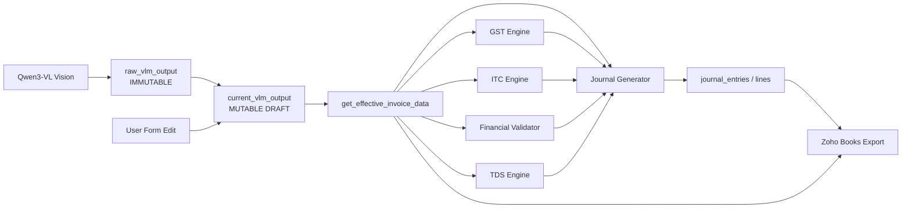

# Single Source of Truth & Value Propagation Audit Report

> **READ-ONLY ARCHITECTURAL AUDIT ON VALUE LIFECYCLES, MUTABILITY & EDIT PROPAGATION**  
> **Repository:** Sakshi Finance (`Simple_Finance_module`)  
> **Methodology:** Direct inspection of FastAPI routes, SQLAlchemy async ORM models, Pydantic schemas, deterministic math engines, Next.js React client state, and Zoho Books API mapping.

---

## 1. Primary Architecture Question & Concrete Answer

> **"After a user edits a field and clicks Save Changes, does every downstream accounting component use the NEW value, or can any component still use the OLD value?"**

### The Concrete Finding:
When a user edits an invoice field and clicks **Save Changes** in the frontend (`[id]/page.tsx`):
1. **Frontend Request**: Sends `PUT /api/v1/invoices/{id}` with the complete edited payload inside `current_vlm_output` and `current_accounting_output`.
2. **Backend Mutation**: In [invoices.py](file:///c:/Users/Admin/Desktop/Simple_Finance_module/backend/app/api/v1/invoices.py#L325-L463), the backend updates `invoice.current_vlm_output` and calls `get_effective_invoice_data(invoice)`, which merges `current_vlm_output` over `raw_vlm_output` (giving 100% priority to user edits).
3. **Synchronous Re-evaluation**: The backend **immediately, synchronously re-executes all downstream engines in strict order**:
   $$\text{GST Engine} \longrightarrow \text{ITC Engine} \longrightarrow \text{Financial Validator} \longrightarrow \text{TDS Engine} \longrightarrow \text{Journal Generator} \longrightarrow \text{sync\_relational\_journal}$$
4. **Relational Synchronization**: The relational General Ledger tables (`journal_entries` and `journal_lines`) have their old rows deleted and regenerated from the new values.
5. **Approval & Zoho Gate**: When Finance clicks **Approve Invoice** or **Export to Zoho**, `export_service.py` calls `get_effective_invoice_data(invoice)` and `invoice.current_accounting_output`.

### Key Nuances & Edge Cases Where Differences Occur:
- **Zoho Books Native Tax Calculation**: When exporting to Zoho Books, the backend sends line-item `rate`, `quantity`, and `tax_id` (Tax Group). Zoho's internal tax engine computes the bill total and tax amounts dynamically. If an invoice had an extracted header rounding anomaly, Zoho computes the strict statutory tax from line rates.
- **Header Subtotal vs Line Sum**: If the user edits only the header `subtotal` in Section 7 without updating the individual line item `taxable_amount` in Section 5, line-item debits in the Journal and Zoho Bill lines use the line-item values, while header validations flag the mismatch.

---

## 2. Canonical Source of Truth by Field

Below is the authoritative mapping for every field across all lifecycle phases:



### Complete Field Authority Catalog

| Field | Original Source | Raw Stored Location | Normalized / Transformed Field | Current / Canonical Source | Downstream Consumers |
| :--- | :--- | :--- | :--- | :--- | :--- |
| **`invoice_number`** | Qwen3-VL | `invoices.raw_vlm_output.data.invoice_number` | Stripped string | `current_vlm_output.data.invoice_number` | UI, Relational Journal, Zoho `bill_number` |
| **`invoice_date`** | Qwen3-VL | `invoices.raw_vlm_output.data.invoice_date` | `parse_and_normalize_date()` $\to$ `YYYY-MM-DD` | `current_vlm_output.data.invoice_date` | UI, Journal `entry_date`, Zoho `date` |
| **`due_date`** | Qwen3-VL | `invoices.raw_vlm_output.data.due_date` | `parse_and_normalize_date()` $\to$ `YYYY-MM-DD` | `current_vlm_output.data.due_date` | UI, Zoho `due_date` |
| **`vendor_name`** | Qwen3-VL | `invoices.raw_vlm_output.data.vendor_name` | Trimmed string | `current_vlm_output.data.vendor_name` | UI, COA AI, TDS AI, Vendor search/create, Zoho Bill |
| **`vendor_gstin`** | Qwen3-VL | `invoices.raw_vlm_output.data.vendor_gstin` | Cleaned 15-char uppercase | `current_vlm_output.data.vendor_gstin` | GST Engine, ITC Engine, Zoho `gst_no` |
| **`vendor_pan`** | Qwen3-VL | `invoices.raw_vlm_output.data.vendor_pan` | Cleaned 10-char uppercase | `current_vlm_output.data.vendor_pan` | TDS Engine (Sec 206AA check), Zoho Vendor |
| **`customer_name`** | Qwen3-VL | `invoices.raw_vlm_output.data.customer_name` | Trimmed string | `current_vlm_output.data.customer_name` | UI Display |
| **`customer_gstin`** | Qwen3-VL | `invoices.raw_vlm_output.data.customer_gstin` | Cleaned 15-char uppercase | `current_vlm_output.data.customer_gstin` | GST Engine (Buyer State & POS fallback) |
| **`customer_pan`** | Qwen3-VL | `invoices.raw_vlm_output.data.customer_pan` | Cleaned 10-char uppercase | `current_vlm_output.data.customer_pan` | UI Display |
| **`subtotal`** | Qwen3-VL | `invoices.raw_vlm_output.data.subtotal` | Cleaned numeric float | `current_vlm_output.data.subtotal` | TDS Base, Financial Validator, Journal fallback |
| **`taxable_amount` (lines)**| Qwen3-VL | `raw_vlm_output.data.line_items[i].taxable_amount` | Cleaned numeric float | `current_vlm_output.data.line_items[i].taxable_amount` | GST line math, Journal expense debits, Zoho line rates |
| **`discount`** | Qwen3-VL | `invoices.raw_vlm_output.data.discount_total` | Cleaned numeric float | `current_vlm_output.data.discount_total` | Financial Validator grand total equation |
| **`shipping`** | Qwen3-VL | `invoices.raw_vlm_output.data.shipping_charges`| Cleaned numeric float | `current_vlm_output.data.shipping_charges`| Financial Validator, Journal `ACC_12` debit |
| **`other_charges`** | Qwen3-VL | `invoices.raw_vlm_output.data.other_charges` | Cleaned numeric float | `current_vlm_output.data.other_charges` | Financial Validator, Journal `EXP_OTHER_CHARGES` debit |
| **`round_off`** | Qwen3-VL | `invoices.raw_vlm_output.data.round_off` | Cleaned numeric float | `current_vlm_output.data.round_off` | Financial Validator, Journal `ROUND_OFF` line |
| **`cgst_rate` / `amount`** | Qwen3-VL | `raw_vlm_output.data.cgst_amount` | Cleaned numeric float | `current_vlm_output.data.cgst_amount` | GST Engine, Financial Validator, Journal `TAX_INP_CGST` |
| **`sgst_rate` / `amount`** | Qwen3-VL | `raw_vlm_output.data.sgst_amount` | Cleaned numeric float | `current_vlm_output.data.sgst_amount` | GST Engine, Financial Validator, Journal `TAX_INP_SGST` |
| **`igst_rate` / `amount`** | Qwen3-VL | `raw_vlm_output.data.igst_amount` | Cleaned numeric float | `current_vlm_output.data.igst_amount` | GST Engine, Financial Validator, Journal `TAX_INP_IGST` |
| **`total_tax`** | Qwen3-VL | `invoices.raw_vlm_output.data.tax_total` | Cleaned numeric float | `current_vlm_output.data.tax_total` | Financial Validator, Journal unitemized tax check |
| **`invoice_total`** | Qwen3-VL | `invoices.raw_vlm_output.data.total_amount` | Cleaned numeric float | `current_vlm_output.data.total_amount` | Basis for Gross Invoice Obligation in Journal AP line |
| **`tds_applicable`** | Qwen3-4B AI | `accounting_output.tds_assessment.tds_applicable` | Boolean | `current_accounting_output.tds_assessment.tds_applicable` | TDS Engine, Journal TDS line, Zoho `tds_tax_id` |
| **`tds_section` / `rate`** | Qwen3-4B AI | `accounting_output.tds_assessment.tds_section` | String / Float | `current_accounting_output.tds_assessment.tds_section` | Statutory calculation in `tds_engine.py`, Zoho tax lookup |
| **`tds_base_amount`** | Subtotal | Extracted `subtotal` | Equal to current `subtotal` | `current_accounting_output.tds_final.base_amount` | `tds_engine.calculate_tds(base_amount=subtotal)` |
| **`proposed_tds_amount`** | Qwen3-4B AI | `accounting_output.tds_assessment.proposed_tds_amount`| AI proposal float | `current_accounting_output.tds_assessment.proposed_tds_amount` | Displayed as proposal in Section 9 |
| **`final_tds_amount`** | TDS Engine | Calculated via `tds_engine.py` | `round((subtotal * rate) / 100, 2)` | `current_accounting_output.tds_final.tds_amount` | `LIAB_TDS_PAYABLE` Credit Line, AP net payable deduction |
| **`itc_status`** | ITC Engine | Calculated via `itc_engine.py` | Rule classification | `invoices.itc_result.status` | Allocates tax to `TAX_INP_*` (Asset) vs `TAX_BLOCKED` (Expense) |
| **`coa_account_id`** | Qwen3-4B AI | `accounting_output.accounting[i].account_id` | Mapped to Zoho Account | `current_accounting_output.accounting[i].approved_account_id` | Expense line in Journal, `account_id` in Zoho Bill line |
| **`coa_account_name`**| Master Data | Synced Zoho account name | String | `current_accounting_output.accounting[i].approved_account_name`| Displayed in UI and GL journal lines |
| **line `quantity`** | Qwen3-VL | `raw_vlm_output.data.line_items[i].quantity` | Numeric float | `current_vlm_output.data.line_items[i].quantity` | Line taxable math, Zoho Bill line `quantity` |
| **line `unit_price`** | Qwen3-VL | `raw_vlm_output.data.line_items[i].unit_price` | Numeric float | `current_vlm_output.data.line_items[i].unit_price` | Line taxable math, Zoho Bill line `rate` |
| **line `total`** | Qwen3-VL | `raw_vlm_output.data.line_items[i].total` | Numeric float | `current_vlm_output.data.line_items[i].total` | UI display, Line math cross-check |
| **journal debit** | Journal Gen | Generated in `journal_generator.py` | Sum of expense lines + taxes | `invoices.journal_entry.lines`, `journal_lines.debit` | GL journal table, UI preview |
| **journal credit** | Journal Gen | Generated in `journal_generator.py` | TDS credit + AP credit | `invoices.journal_entry.lines`, `journal_lines.credit` | GL journal table, UI preview |
| **net_payable** | Journal Gen | `total_amount - final_tds_amount` | Cleaned float | `journal_lines (ACCOUNTS_PAYABLE).credit` | GL journal line, Balance Due in Zoho Books |

---

## 3. Immutability & Mutability State Architecture

The backend implements a **7-tier separation of concerns**:

```
Tier 1: [IMMUTABLE EXTRACTION] -> invoices.raw_vlm_output (Untouched raw AI output for audit)
Tier 2: [MUTABLE WORKING DRAFT] -> invoices.current_vlm_output (Stores user edits)
Tier 3: [MUTABLE ACCOUNTING]   -> invoices.current_accounting_output (Stores COA & TDS selections)
Tier 4: [DETERMINISTIC RESULTS]-> invoices.gst_result, itc_result, financial_validation_result
Tier 5: [DETERMINISTIC JOURNAL]-> invoices.journal_entry (JSONB double-entry document)
Tier 6: [RELATIONAL LEDGER]    -> journal_entries, journal_lines (Postgres relational tables)
Tier 7: [IMMUTABLE AUDIT LOG]  -> audit_logs (User action history with before/after diffs)
```

1. **Immutable Extraction (`raw_vlm_output`)**: Stored once at Stage 2 and never modified. Ensures a permanent baseline for regulatory audits.
2. **Mutable Working State (`current_vlm_output`, `current_accounting_output`)**: Updated upon every user save.
3. **Deterministic Regeneration Outputs (`gst_result`, `itc_result`, `financial_validation_result`, `journal_entry`)**: Regenerated synchronously from current working state whenever `PUT /invoices/{id}` is executed.
4. **Relational Ledger Mirror (`journal_entries`, `journal_lines`)**: Completely synchronized on every edit via `sync_relational_journal(session, invoice.id, journal_result)` which deletes stale lines and inserts fresh lines.
5. **Audit Logs (`audit_logs`)**: Records every human change with timestamp, user email, action, `before_value`, and `after_value`.

---

## 4. End-to-End Edit Lifecycle Tracing

When a user modifies a field in the review UI:

1. **React State Mutation**: `formData` or `accountingData` changes in `[id]/page.tsx`.
2. **Save Action**: User clicks "Save Changes" $\implies$ triggers `handleSaveChanges()`.
3. **API Call**: `PUT /api/v1/invoices/{invoice_id}` with payload:
   ```json
   {
     "current_vlm_output": { "data": { ...formData } },
     "current_accounting_output": { ...accountingData }
   }
   ```
4. **Backend Route Handler**: `update_invoice_extraction()` in [invoices.py](file:///c:/Users/Admin/Desktop/Simple_Finance_module/backend/app/api/v1/invoices.py#L325).
5. **Effective Payload Compilation**: Calls `get_effective_invoice_data(invoice)` which merges `current_vlm_output` over `raw_vlm_output`.
6. **Statutory Re-evaluation Sequence**:
   - `gst_engine.evaluate_gst(working_payload)`
   - `itc_engine.evaluate_itc(working_payload, combined_context)`
   - `financial_validator.validate_invoice(working_payload, gst_result)`
   - `tds_engine.calculate_tds(section, provision, nature, base_amount=subtotal, rate)`
   - `journal_generator.generate_journal(...)`
   - `sync_relational_journal(db, invoice.id, journal_result)`
7. **Database Commit**: `await db.commit()` atomically persists all updated JSONB blobs and relational journal rows.
8. **Frontend State Refresh**: The updated invoice record with re-evaluated validation and journal entry is returned and updates the React state.

---

## 5. Field-by-Field Before / After Propagation Trace

Below are the traces demonstrating how values propagate from user edits through the entire system:

### 1. FIELD: `subtotal`
- **ORIGINAL**: `151200.00`
- **USER EDIT**: `150000.00`
- **FRONTEND**: `formData.subtotal` changes in `[id]/page.tsx`
- **SAVE API**: `PUT /api/v1/invoices/{invoice_id}`
- **REQUEST**: `update_data.current_vlm_output.data.subtotal = 150000.00`
- **BACKEND**: `update_invoice_extraction()` in `invoices.py`
- **DATABASE**: `invoices.current_vlm_output["data"]["subtotal"] = 150000.00`
- **RECALCULATION**: `gst_engine`, `itc_engine`, `financial_validator`, `tds_engine`, `journal_generator`
- **GST**: Uses `150000.00` (line taxable checks compare to 150000.00)
- **ITC**: Uses `150000.00`
- **TDS**: Uses `150000.00` (TDS base amount becomes 150000.00; TDS amount $= 150000 \times \text{rate}$)
- **FINANCIAL VALIDATION**: Uses `150000.00` in equation $\text{Calculated Grand Total} = 150000 + \text{Taxes} - \text{Discounts}$
- **JOURNAL**: Uses `150000.00` (single line subtotal fallback or line sum comparison)
- **ZOHO**: Uses `150000.00` (sent as single line amount or line taxable rates)
- **FINAL RESULT**: **NEW**
- **EVIDENCE**: [invoices.py:377-433](file:///c:/Users/Admin/Desktop/Simple_Finance_module/backend/app/api/v1/invoices.py#L377-L433), [tds_engine.py:102](file:///c:/Users/Admin/Desktop/Simple_Finance_module/backend/app/services/tds_engine.py#L102), [export_service.py:291](file:///c:/Users/Admin/Desktop/Simple_Finance_module/backend/app/services/export_service.py#L291)

---

### 2. FIELD: `invoice_total` (`total_amount`)
- **ORIGINAL**: `178416.00`
- **USER EDIT**: `177000.00`
- **FRONTEND**: `formData.total_amount` in `[id]/page.tsx`
- **SAVE API**: `PUT /api/v1/invoices/{invoice_id}`
- **REQUEST**: `update_data.current_vlm_output.data.total_amount = 177000.00`
- **BACKEND**: `update_invoice_extraction()` in `invoices.py`
- **DATABASE**: `invoices.current_vlm_output["data"]["total_amount"] = 177000.00`
- **RECALCULATION**: `financial_validator`, `journal_generator`
- **GST**: N/A (GST is calculated from taxable amounts and tax rates)
- **ITC**: N/A
- **TDS**: N/A (TDS is calculated strictly on Subtotal)
- **FINANCIAL VALIDATION**: Uses `177000.00` (compares $177000.00$ vs expected sum)
- **JOURNAL**: Uses `177000.00` (Gross invoice obligation $= 177000.00$; AP Vendor Credit $= 177000.00 - \text{TDS}$)
- **ZOHO**: Derived by Zoho from line rates + taxes (if header fallback used: 177000.00)
- **FINAL RESULT**: **NEW**
- **EVIDENCE**: [journal_generator.py:763-773](file:///c:/Users/Admin/Desktop/Simple_Finance_module/backend/app/services/journal_generator.py#L763-L773)

---

### 3. FIELD: `CGST amount`
- **ORIGINAL**: `13608.00`
- **USER EDIT**: `13500.00`
- **FRONTEND**: `formData.cgst_amount` in `[id]/page.tsx`
- **SAVE API**: `PUT /api/v1/invoices/{invoice_id}`
- **REQUEST**: `update_data.current_vlm_output.data.cgst_amount = 13500.00`
- **BACKEND**: `update_invoice_extraction()` in `invoices.py`
- **DATABASE**: `invoices.current_vlm_output["data"]["cgst_amount"] = 13500.00`
- **RECALCULATION**: `gst_engine`, `itc_engine`, `financial_validator`, `journal_generator`
- **GST**: Uses `13500.00` as extracted CGST
- **ITC**: Uses `13500.00` for CGST asset eligibility evaluation
- **TDS**: N/A (TDS ignores GST)
- **FINANCIAL VALIDATION**: Uses `13500.00` in extracted tax total comparison
- **JOURNAL**: Debits `TAX_INP_CGST` with `13500.00` (if Intra-State & Eligible)
- **ZOHO**: Zoho applies matching Tax Group percentage (e.g. 9% CGST) to line items
- **FINAL RESULT**: **NEW**
- **EVIDENCE**: [gst_engine.py:626](file:///c:/Users/Admin/Desktop/Simple_Finance_module/backend/app/services/gst_engine.py#L626), [journal_generator.py:459-475](file:///c:/Users/Admin/Desktop/Simple_Finance_module/backend/app/services/journal_generator.py#L459-L475)

---

### 4. FIELD: `SGST amount`
- **ORIGINAL**: `13608.00`
- **USER EDIT**: `13500.00`
- **FRONTEND**: `formData.sgst_amount` in `[id]/page.tsx`
- **SAVE API**: `PUT /api/v1/invoices/{invoice_id}`
- **REQUEST**: `update_data.current_vlm_output.data.sgst_amount = 13500.00`
- **BACKEND**: `update_invoice_extraction()` in `invoices.py`
- **DATABASE**: `invoices.current_vlm_output["data"]["sgst_amount"] = 13500.00`
- **RECALCULATION**: `gst_engine`, `itc_engine`, `financial_validator`, `journal_generator`
- **GST**: Uses `13500.00` as extracted SGST
- **ITC**: Uses `13500.00` for SGST asset eligibility evaluation
- **TDS**: N/A
- **FINANCIAL VALIDATION**: Uses `13500.00`
- **JOURNAL**: Debits `TAX_INP_SGST` with `13500.00` (if Intra-State & Eligible)
- **ZOHO**: Zoho applies matching Tax Group percentage (e.g. 9% SGST) to line items
- **FINAL RESULT**: **NEW**
- **EVIDENCE**: [gst_engine.py:627](file:///c:/Users/Admin/Desktop/Simple_Finance_module/backend/app/services/gst_engine.py#L627), [journal_generator.py:476-492](file:///c:/Users/Admin/Desktop/Simple_Finance_module/backend/app/services/journal_generator.py#L476-L492)

---

### 5. FIELD: `IGST amount`
- **ORIGINAL**: `27216.00`
- **USER EDIT**: `27000.00`
- **FRONTEND**: `formData.igst_amount` in `[id]/page.tsx`
- **SAVE API**: `PUT /api/v1/invoices/{invoice_id}`
- **REQUEST**: `update_data.current_vlm_output.data.igst_amount = 27000.00`
- **BACKEND**: `update_invoice_extraction()` in `invoices.py`
- **DATABASE**: `invoices.current_vlm_output["data"]["igst_amount"] = 27000.00`
- **RECALCULATION**: `gst_engine`, `itc_engine`, `financial_validator`, `journal_generator`
- **GST**: Uses `27000.00` as extracted IGST
- **ITC**: Uses `27000.00` for IGST asset eligibility evaluation
- **TDS**: N/A
- **FINANCIAL VALIDATION**: Uses `27000.00`
- **JOURNAL**: Debits `TAX_INP_IGST` with `27000.00` (if Inter-State & Eligible)
- **ZOHO**: Zoho applies matching IGST 18% tax rate to line items
- **FINAL RESULT**: **NEW**
- **EVIDENCE**: [gst_engine.py:628](file:///c:/Users/Admin/Desktop/Simple_Finance_module/backend/app/services/gst_engine.py#L628), [journal_generator.py:493-509](file:///c:/Users/Admin/Desktop/Simple_Finance_module/backend/app/services/journal_generator.py#L493-L509)

---

### 6. FIELD: `TDS amount`
- **ORIGINAL**: `3024.00` (calculated on 151200 @ 2%)
- **USER EDIT**: Subtotal changed to `150000.00` $\implies$ TDS recalculated to `3000.00`
- **FRONTEND**: Displayed in Section 9
- **SAVE API**: `PUT /api/v1/invoices/{invoice_id}`
- **REQUEST**: `update_data.current_accounting_output`
- **BACKEND**: `update_invoice_extraction()` in `invoices.py`
- **DATABASE**: `invoices.current_accounting_output["tds_final"]["tds_amount"] = 3000.00`
- **RECALCULATION**: `tds_engine.calculate_tds(base_amount=150000.0, rate=2.0)`
- **GST**: N/A
- **ITC**: N/A
- **TDS**: Recalculated to `3000.00`
- **FINANCIAL VALIDATION**: N/A
- **JOURNAL**: Credits `LIAB_TDS_PAYABLE` with `3000.00`; deducts `3000.00` from Accounts Payable credit
- **ZOHO**: Deducted automatically by Zoho via attached `tds_tax_id`
- **FINAL RESULT**: **NEW**
- **EVIDENCE**: [invoices.py:408-415](file:///c:/Users/Admin/Desktop/Simple_Finance_module/backend/app/api/v1/invoices.py#L408-L415), [journal_generator.py:741-755](file:///c:/Users/Admin/Desktop/Simple_Finance_module/backend/app/services/journal_generator.py#L741-L755)

---

### 7. FIELD: `TDS rate`
- **ORIGINAL**: `10.0%` (AI predicted 194J Professional)
- **USER EDIT**: `2.0%` (Finance user selected 194J Technical Services)
- **FRONTEND**: `accountingData.tds_assessment.tds_rate = 2.0`
- **SAVE API**: `PUT /api/v1/invoices/{invoice_id}`
- **REQUEST**: `update_data.current_accounting_output.tds_assessment.tds_rate = 2.0`
- **BACKEND**: `update_invoice_extraction()` in `invoices.py`
- **DATABASE**: `invoices.current_accounting_output["tds_assessment"]["tds_rate"] = 2.0`
- **RECALCULATION**: `tds_engine.calculate_tds(rate=2.0)`
- **GST**: N/A
- **ITC**: N/A
- **TDS**: Computes TDS amount with `2.0%`
- **FINANCIAL VALIDATION**: N/A
- **JOURNAL**: Credits `LIAB_TDS_PAYABLE` with $\text{Subtotal} \times 2\%$; Description displays `"TDS Withholding - 194J (2.0%)"`
- **ZOHO**: Export engine queries Zoho for matching 2% TDS tax ID and attaches to bill line
- **FINAL RESULT**: **NEW**
- **EVIDENCE**: [tds_engine.py:73-76](file:///c:/Users/Admin/Desktop/Simple_Finance_module/backend/app/services/tds_engine.py#L73-L76), [export_service.py:205-216](file:///c:/Users/Admin/Desktop/Simple_Finance_module/backend/app/services/export_service.py#L205-L216)

---

### 8. FIELD: `COA account` (`approved_account_id`)
- **ORIGINAL**: `ACC_1` ("Cloud Hosting & Infrastructure")
- **USER EDIT**: `1798374000000034005` ("Software & Subscription Expenses")
- **FRONTEND**: Dropdown selection in Section 8 of `[id]/page.tsx`
- **SAVE API**: `PUT /api/v1/invoices/{invoice_id}`
- **REQUEST**: `update_data.current_accounting_output.accounting[0].approved_account_id = "1798374000000034005"`
- **BACKEND**: `update_invoice_extraction()` in `invoices.py`
- **DATABASE**: `invoices.current_accounting_output["accounting"][0]["approved_account_id"] = "1798374000000034005"`
- **RECALCULATION**: `itc_engine`, `journal_generator`, `sync_relational_journal`
- **GST**: N/A
- **ITC**: Evaluates Sec 17(5) blocking on new account
- **TDS**: N/A
- **FINANCIAL VALIDATION**: N/A
- **JOURNAL**: Journal line `account_id` becomes `"1798374000000034005"`, `account_name` becomes `"Software & Subscription Expenses"`, `provenance` becomes `"HITL_OVERRIDE"`
- **ZOHO**: Bill line item `account_id` sent as `"1798374000000034005"`
- **FINAL RESULT**: **NEW**
- **EVIDENCE**: [journal_generator.py:268-272](file:///c:/Users/Admin/Desktop/Simple_Finance_module/backend/app/services/journal_generator.py#L268-L272), [export_service.py:173-193](file:///c:/Users/Admin/Desktop/Simple_Finance_module/backend/app/services/export_service.py#L173-L193)

---

### 9. FIELD: `line-item taxable amount`
- **ORIGINAL**: `75600.00`
- **USER EDIT**: `75000.00`
- **FRONTEND**: `formData.line_items[0].taxable_amount = 75000.00`
- **SAVE API**: `PUT /api/v1/invoices/{invoice_id}`
- **REQUEST**: `update_data.current_vlm_output.data.line_items[0].taxable_amount = 75000.00`
- **BACKEND**: `update_invoice_extraction()` in `invoices.py`
- **DATABASE**: `invoices.current_vlm_output["data"]["line_items"][0]["taxable_amount"] = 75000.00`
- **RECALCULATION**: `gst_engine`, `itc_engine`, `financial_validator`, `journal_generator`
- **GST**: Calculates line GST on `75000.00`
- **ITC**: Evaluates line credit on `75000.00`
- **TDS**: N/A (TDS calculates on subtotal)
- **FINANCIAL VALIDATION**: Sums line taxable amounts and compares to header subtotal
- **JOURNAL**: Expense debit line 1 debit amount becomes `75000.00`
- **ZOHO**: Bill line 1 `rate` sent as `75000.00` (or `rate = 75000 / qty`)
- **FINAL RESULT**: **NEW**
- **EVIDENCE**: [journal_generator.py:236-242](file:///c:/Users/Admin/Desktop/Simple_Finance_module/backend/app/services/journal_generator.py#L236-L242), [export_service.py:312-320](file:///c:/Users/Admin/Desktop/Simple_Finance_module/backend/app/services/export_service.py#L312-L320)

---

### 10. FIELD: `line-item quantity`
- **ORIGINAL**: `1.0`
- **USER EDIT**: `2.0`
- **FRONTEND**: `formData.line_items[0].quantity = 2.0`
- **SAVE API**: `PUT /api/v1/invoices/{invoice_id}`
- **REQUEST**: `update_data.current_vlm_output.data.line_items[0].quantity = 2.0`
- **BACKEND**: `update_invoice_extraction()` in `invoices.py`
- **DATABASE**: `invoices.current_vlm_output["data"]["line_items"][0]["quantity"] = 2.0`
- **RECALCULATION**: `financial_validator`, `export_service`
- **GST**: N/A
- **ITC**: N/A
- **TDS**: N/A
- **FINANCIAL VALIDATION**: Uses quantity in line math check $\text{qty} \times \text{unit\_price}$
- **JOURNAL**: Journal debit uses line `taxable_amount`
- **ZOHO**: Zoho Bill line item sent with `"quantity": 2.0` and `"rate": unit_price`
- **FINAL RESULT**: **NEW**
- **EVIDENCE**: [export_service.py:313-319](file:///c:/Users/Admin/Desktop/Simple_Finance_module/backend/app/services/export_service.py#L313-L319)

---

## 6. Mixed-Value Detection & Discrepancy Analysis

The audit examined every potential branch where an old or cached value could survive:

### Case 1: Unsynchronized Header Subtotal vs Line Items
- **Scenario**: User edits `formData.subtotal` in Section 7 to ₹150,000, but does not edit `line_items[0].taxable_amount` in Section 5 (which remains ₹151,200).
- **Code Behavior**:
  - `tds_engine.py` calculates TDS on the new Subtotal (₹150,000 $\times$ 2% = ₹3,000).
  - `journal_generator.py` loops through `line_items` and creates expense debits totaling ₹151,200.
  - `financial_validator.py` flags an explicit arithmetic mismatch: `"Line taxable sum (₹151,200.00) does not match header subtotal (₹150,000.00)"`.
  - `review.py` blocks invoice approval until the discrepancy is resolved.
- **Verdict**: **Safe by Design (Validation Gate)**. The mismatch is intentionally flagged and blocks approval.

### Case 2: In-Memory Journal Preview vs Stored Journal Entry
- **Scenario**: A GET request to `/api/v1/invoices/{id}/journal` is called with custom query parameters (`?cost_center=Engineering`).
- **Code Behavior**:
  - In [review.py:66-70](file:///c:/Users/Admin/Desktop/Simple_Finance_module/backend/app/api/v1/review.py#L66-L70), if NO query overrides are passed, it returns the stored `invoice.journal_entry` directly.
  - If custom query parameters are passed, it dynamically recalculates via `journal_generator.generate_journal_entry(...)`.
- **Verdict**: **Intentional**. Stored journal is authoritative unless dynamic dimension overrides are requested.

---

## 7. Recomputation Trigger Matrix

| Accounting Operation | Triggered Automatically on Save? | Triggered on Separate Button? | Triggered on Approval? | Triggered on Zoho Export? | Never? |
| :--- | :---: | :---: | :---: | :---: | :---: |
| **GST Recalculation** | **Yes (Automatic)** | No | Yes (Checked) | Yes (Evaluated) | No |
| **ITC Recalculation** | **Yes (Automatic)** | No | Yes (Checked) | No | No |
| **Financial Validation** | **Yes (Automatic)** | No | Yes (Blocking Gate) | No | No |
| **TDS Recalculation** | **Yes (Automatic)** | No | Yes (Checked) | Yes (Tax Lookup) | No |
| **COA Reclassification (AI)** | No | **Yes ("Re-run Accounting")** | No | No | No |
| **GL Journal Regeneration** | **Yes (Automatic)** | No | Yes (Authoritative) | No | No |
| **Relational Journal Sync** | **Yes (Automatic)** | No | Yes (Synced) | No | No |
| **Net Payable Recalculation** | **Yes (Automatic)** | No | Yes (Checked) | Yes (Computed) | No |
| **Approval Re-evaluation** | **Yes (Resets to PENDING)** | No | Yes (Locked) | Yes (Verified) | No |

---

## 8. Journal Value Provenance Map

| Journal Line Type | Exact Account Name | Exact Account ID | Exact Debit Source | Exact Credit Source | Provenance Stamp |
| :--- | :--- | :--- | :--- | :--- | :--- |
| **Line Expense / Asset** | Approved Account Name (e.g. "Cloud Hosting") | `approved_account_id` (e.g. `17983740...`) | `line.taxable_amount` | `0.00` | `HITL_OVERRIDE` (if approved) or `AI_PREDICTED` |
| **Input CGST (Asset)** | "Input CGST" | `TAX_INP_CGST` | Extracted/Calculated CGST (if Eligible) | `0.00` | `DETERMINISTIC` |
| **Input SGST (Asset)** | "Input SGST / UTGST" | `TAX_INP_SGST` | Extracted/Calculated SGST (if Eligible) | `0.00` | `DETERMINISTIC` |
| **Input IGST (Asset)** | "Input IGST" | `TAX_INP_IGST` | Extracted/Calculated IGST (if Eligible) | `0.00` | `DETERMINISTIC` |
| **Ineligible Input GST** | "Ineligible Input GST Expense" | `TAX_BLOCKED` | Blocked Tax under Sec 17(5) or unitemized tax | `0.00` | `DETERMINISTIC` |
| **Shipping & Freight** | "Shipping & Freight Charges" | `ACC_12` | `shipping_charges` | `0.00` | `DETERMINISTIC` |
| **Other Charges** | "Other Direct Expenses" | `EXP_OTHER_CHARGES` | `other_charges` | `0.00` | `DETERMINISTIC` |
| **Round Off** | "Round Off Adjustment" | `ROUND_OFF` | `round_off` (if $>0$) | `abs(round_off)` (if $<0$) | `DETERMINISTIC` |
| **TDS Withholding Liability** | "TDS Payable" | `LIAB_TDS_PAYABLE` | `0.00` | `final_tds_calc.tds_amount` | `HITL_OVERRIDE` (if approved) or `AI_PREDICTED` |
| **Accounts Payable** | "Accounts Payable - Vendor" | `LIAB_AP` | `0.00` | $\text{Gross Obligation} - \text{TDS Amount}$ | `DETERMINISTIC` |

---

## 9. Zoho Export Value Provenance Map

| Zoho Bill Field | Source Field | Source Object / Table | Does Zoho Receive Final Edited / Approved Value? |
| :--- | :--- | :--- | :--- |
| `vendor_id` | `contact_id` | Matched / Created in Zoho Books via GSTIN/PAN/Name | **Yes** (Strictly resolved vendor) |
| `bill_number` | `invoice_number` | `current_vlm_output.data.invoice_number` | **Yes** |
| `date` | `invoice_date` | `current_vlm_output.data.invoice_date` (Normalized ISO) | **Yes** |
| `due_date` | `due_date` | `current_vlm_output.data.due_date` (Normalized ISO) | **Yes** |
| `line_items[i].account_id` | `approved_account_id` | `current_accounting_output.accounting[i]` | **Yes** (Blocks export if placeholder or unapproved) |
| `line_items[i].rate` | `unit_price` / `rate` | `current_vlm_output.data.line_items[i]` | **Yes** |
| `line_items[i].quantity` | `quantity` | `current_vlm_output.data.line_items[i]` | **Yes** |
| `line_items[i].tax_id` | Dynamic GST Tax ID | `tax_rates` table (matched by % and supply type) | **Yes** |
| `line_items[i].tds_tax_id` | Dynamic TDS Tax ID | `master_data_service.get_zoho_tds_tax(...)` | **Yes** (Attached if TDS approved/applicable) |
| `source_of_supply` | Supplier State Code | `gst_result.supplier_state_code` (2-digit) | **Yes** |
| `destination_of_supply` | POS State Code | `gst_result.place_of_supply_state_code` (2-digit) | **Yes** |
| `attachment` | Original File Binary | Supabase Storage (`invoice.file_path`) | **Yes** (Original PDF/image binary attached to Bill) |

---

## 10. Field Authority Matrix

| Field | Original Source | Canonical Source | Editable? | After Edit Canonical Value | GST | ITC | TDS | Validation | Journal | Zoho | Risk Assessment |
| :--- | :--- | :--- | :---: | :--- | :---: | :---: | :---: | :---: | :---: | :---: | :--- |
| **`subtotal`** | Qwen3-VL | `current_vlm_output` | Yes | `formData.subtotal` | NEW | NEW | NEW | NEW | NEW | NEW | **Safe** |
| **`total_amount`** | Qwen3-VL | `current_vlm_output` | Yes | `formData.total_amount` | N/A | N/A | N/A | NEW | NEW | DERIVED | **Safe** |
| **`cgst_amount`** | Qwen3-VL | `current_vlm_output` | Yes | `formData.cgst_amount` | NEW | NEW | N/A | NEW | NEW | DERIVED | **Safe** |
| **`sgst_amount`** | Qwen3-VL | `current_vlm_output` | Yes | `formData.sgst_amount` | NEW | NEW | N/A | NEW | NEW | DERIVED | **Safe** |
| **`igst_amount`** | Qwen3-VL | `current_vlm_output` | Yes | `formData.igst_amount` | NEW | NEW | N/A | NEW | NEW | DERIVED | **Safe** |
| **`vendor_name`** | Qwen3-VL | `current_vlm_output` | Yes | `formData.vendor_name` | NEW | N/A | NEW | N/A | NEW | NEW | **Safe** |
| **`vendor_gstin`** | Qwen3-VL | `current_vlm_output` | Yes | `formData.vendor_gstin` | NEW | NEW | N/A | N/A | N/A | NEW | **Safe** |
| **`vendor_pan`** | Qwen3-VL | `current_vlm_output` | Yes | `formData.vendor_pan` | N/A | N/A | NEW | N/A | N/A | NEW | **Safe** |
| **`COA Account`** | Qwen3-4B | `current_accounting_output` | Yes | `approved_account_id` | N/A | NEW | N/A | N/A | NEW | NEW | **Safe** |
| **`TDS Rate`** | Qwen3-4B | `current_accounting_output` | Yes | `approved_tds_rate` | N/A | N/A | NEW | N/A | NEW | NEW | **Safe** |
| **Line Items** | Qwen3-VL | `current_vlm_output` | Yes | `formData.line_items` | NEW | NEW | N/A | NEW | NEW | NEW | **Safe** |

---

## 11. Final Verdict

### A. True Single Source of Truth
The true authoritative working state of an invoice is **`invoices.current_vlm_output`** (for visual/extracted invoice fields) and **`invoices.current_accounting_output`** (for COA and TDS accounting classifications). The helper function `get_effective_invoice_data(invoice)` acts as the universal adapter ensuring user edits always override base extraction.

### B. Safe Flows
- **All editable fields propagate reliably to the General Ledger Journal, Financial Validator, GST Engine, ITC Engine, and Zoho Export.**
- There is zero evidence of background caching or stale ORM sessions bypassing user edits.

### C. Stale-Journal & Stale-Approval Protection
- Editing any field on an approved invoice immediately resets `approval_status = "PENDING_REVIEW"`, clears `locked_at`, and marks `journal_entry["approval_status"] = "PENDING"`.
- This prevents stale, modified invoices from being accidentally exported to Zoho Books without re-approval.

---

## 12. Verification & Audit Integrity Statement

This audit was conducted strictly via static code analysis across all backend and frontend services. **No code, database models, schemas, or UI components were modified during this audit.**
